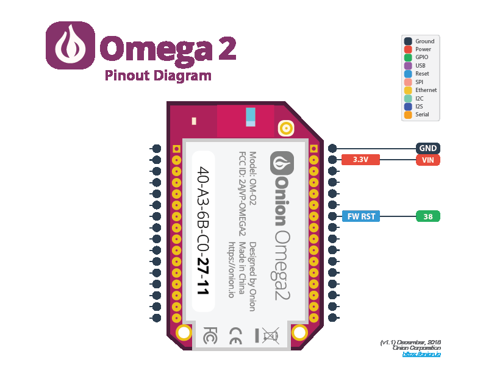
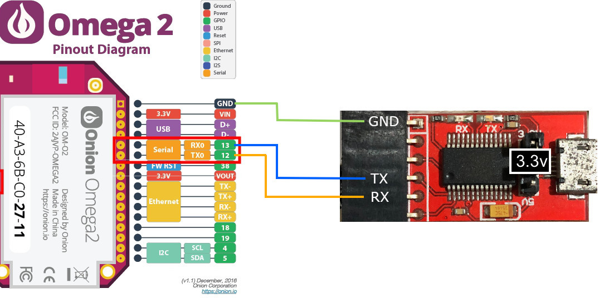

# OpenWrt on Onion Omega 2+

Apparently Omega 2+ not starting up after reboot. Need to reconnect power.

# Firmware Upgrade

[Firmware Page](https://openwrt.org/toh/hwdata/onion/onion_omega2plus)

[Sysupgrade Command Doc](https://openwrt.org/docs/guide-user/installation/sysupgrade.cli)

```
sysupgrade -v /path/to/*.bin
```

You can add the `-n` option if you DO NOT want to preserve any old configuration files and configure upgraded device from clean state (network/system settings will be lost as well)

## Wireless

Wireless adapter is disabled by default after factory reset.

* Edit `/etc/config/wireless` to enable 'radio0' interface.
* Turn wireless on:
```
wifi up radio0
```
* 'OpenWrt' WiFi access point should appear

## Omega Opkg Feeds

```
src/gz omega2_core http://repo.onioniot.com/omega2/packages/core
src/gz omega2_base http://repo.onioniot.com/omega2/packages/base
src/gz omega2_packages http://repo.onioniot.com/omega2/packages/packages
src/gz omega2_routing http://repo.onioniot.com/omega2/packages/routing
src/gz omega2_onion http://repo.onioniot.com/omega2/packages/onion
```

## Reset Button Wiring

[How to wire button for factory reset?](http://community.onion.io/topic/1827/how-to-wire-button-for-factory-reset/2)



Connecting `Reset` pin to HI for 10 seconds triggers factory reset.

## Serial Connection Wiring



MacOS/Linux command to connect to serial interface (device file will probably differ):
```
screen /dev/tty.usbserial-AI024OWN 115200
```

## OpenWrt Reset

[Reset Docs](https://openwrt.org/docs/guide-user/troubleshooting/failsafe_and_factory_reset)

### Soft Factory Reset 
```
firstboot -y && reboot now
```

### Hard Factory Reset
```
umount /overlay && jffs2reset && reboot now
```

## Mound Fat32 micro SD cart

List supported filesystems:
```
cat /proc/filesystems
```

## Python
```
opkg update
opkg install python-light
```

### GPIO
```
opkg install http://repo.onioniot.com.s3.amazonaws.com/omega2/packages/onion/pyOnionGpio_0.2-1_mipsel_24kc.ipk
```

[Python GPIO Doc](https://docs.onion.io/omega2-docs/gpio-python-module.html#gpio-python-module)

